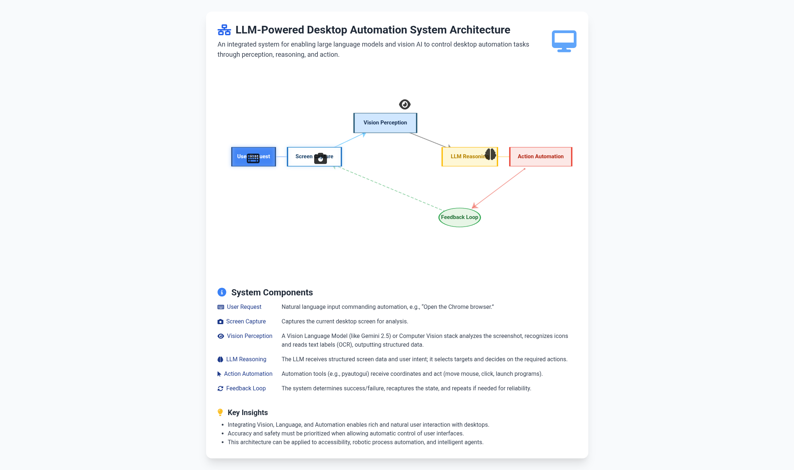

# LLM Desktop Automation with Gemini 2.5 Vision

Automate desktop interactions using AI vision & language capabilities.

## Overview

**LLM Desktop Automation** is a Python framework that empowers you to control your desktop UI by natural language prompts.
Harness the power of **Gemini 2.5 Vision's API** to visually understand your desktop, process commands, and perform intelligent mouse clicks using AI reasoning.



## Features

-   Vision-powered recognition of desktop icons and windows
-   Smart mouse movement & click via `pyautogui`
-   Natural language instructions powered by Gemini 2.5 LLM
-   Built-in safety prompts before high-impact actions
-   Pythonic and readable code, ready to extend

## How It Works

1.  User types a command: `Open Recycle Bin`
2.  Screenshot of desktop is taken
3.  Screenshot is sent to **Gemini 2.5 Vision** for detection of clickable elements
4.  Structured screen analysis (elements + coordinates) is returned
5.  LLM matches user instruction to visual data, selects the target
6.  Python script uses `pyautogui` to move mouse and click the target
7.  (Optional) User is prompted to confirm risky actions

## Installation

```bash
# Clone the repository
git clone https://github.com/dalijon-byte/LLM-ComputerUse.git
cd LLM-ComputerUse.git

# Install Python dependencies (Python 3.8+ recommended)
pip install -r requirements.txt
```

## Configuration

1.  **Set up Gemini API key:**
    *   Sign up for Gemini API and get your key: [Get API Key](https://aistudio.google.com/app/apikey)
    *   Create a `.env` file in your project root:
        ```dotenv
        GEMINI_API_KEY=your_gemini_2.5_vision_api_key_here
        ```
2.  **Adjust permissions:** This script requires permission to capture your screen and control your mouse.

## Usage Example

```bash
python desktop_automation.py
```

When prompted, type commands like:
`Click the Chrome icon`
`Open Notepad`
`Open the Recycle Bin`

## Minimal Example

```python
import os, pyautogui
from PIL import ImageGrab
import google.generativeai as genai
# ... Set up Gemini as in documentation

screenshot = ImageGrab.grab()
# Send screenshot and prompt to Gemini
# Parse result, get coordinates
pyautogui.moveTo(x, y)
pyautogui.click()
```
## Advanced Template-Based Workflow

This project now supports two different approaches to desktop automation:

1. **Direct Coordinate-Based Automation** (original approach)
2. **Template Matching-Based Automation** (new approach)

### Template Matching Workflow

The template-based approach provides greater reliability across different screen resolutions and window positions:

1. **Screen Analysis**: Capture the screen and send to Gemini 2.5 Vision
2. **Element Extraction**: Gemini identifies UI elements and returns their bounding boxes
3. **Template Creation**: Small images of each UI element are cropped and saved
4. **Template Matching**: When actions are needed, PyAutoGUI looks for these templates on screen
5. **Action Execution**: Once found, the system can click, type, drag, etc.

### Advanced Features

The system now supports these advanced interactions:

- `click(start_box='[x1, y1, x2, y2]')` - Single left click
- `left_double(start_box='[x1, y1, x2, y2]')` - Double left click
- `right_single(start_box='[x1, y1, x2, y2]')` - Single right click
- `drag(start_box='[x1, y1, x2, y2]', end_box='[x3, y3, x4, y4]')` - Drag and drop
- `hotkey(key='ctrl+c')` - Press keyboard shortcuts
- `type(content='Hello world\n')` - Type text (use '\n' for Enter)
- `scroll(start_box='[x1, y1, x2, y2]', direction='down')` - Scroll in specified direction
- `wait()` - Pause for 5 seconds
- `finished()` - Mark task as complete
- `call_user()` - Request human assistance

### Usage Example

```python
# Template-based automation
python template_automation.py

# When prompted:
# "What would you like me to do?"

# Try these commands:
"Open Google Chrome"
"Create a new text document"
"Move the calculator to the right side of the screen"
```

## Security Warning

> **Warning:** Running this code gives the AI limited control of your mouse and keyboard.
> Only use in safe, controlled environments. Carefully review all actions before confirming.

## Project Structure

```
LLM-ComputerUse/
├── README.md
├── desktop_automation.py (original approach)
├── template_automation.py (new template-based approach)
├── requirements.txt
├── templates/ (directory for extracted templates)
└── utils/
    ├── __init__.py
    ├── screen_capture.py
    ├── element_extraction.py
    └── action_execution.py
```

## Dependencies

-   `python-dotenv`
-   `google-generativeai`
-   `pyautogui`
-   `pillow` (PIL)

## Extending

You can add:

-   Voice command input via `SpeechRecognition`
-   Better vision models with OpenCV, YOLO, or LLaVA
-   Self-verification for critical clicks

## Troubleshooting

-   Errors about permissions? See your OS's privacy/accessibility settings for screen and input control
-   Mouse not clicking where expected? Check your display scaling and resolution settings
-   Gemini errors? Ensure API key is correct and you have quota

## Potential Future Enhancements

Here are some additional enhancements you could consider:

1. **Template Database**: Store templates with metadata for reuse across sessions
2. **Visual Feedback**: Show bounding boxes on detected elements for user verification
3. **Action Sequences**: Record and replay multiple actions as macros
4. **Error Recovery**: Implement retry mechanisms when template matching fails
5. **Context Awareness**: Maintain a model of desktop state between actions
6. **Voice Integration**: Add voice control capabilities for hands-free operation
7. **Application-Specific Templates**: Pre-train on common applications like Office, browsers

## Implementation Tips

1. **Confidence Parameter**: PyAutoGUI's `locateCenterOnScreen` function has a `confidence` parameter (requires OpenCV). Start with 0.8 and adjust based on reliability.

2. **Template Size**: Smaller templates may be less distinctive but find more matches. Larger templates are more specific but might fail with small UI changes.

3. **Error Handling**: Template matching can fail for many reasons - implement good error handling and fallback mechanisms.

4. **Security Considerations**: Continue to prioritize safety checks, especially with broader action capabilities. 

## FAQ

<details open>
  <summary>Is this production ready?</summary>
  <p>No – it is a research/prototype tool. Use in controlled environments only.</p>
</details>
<details>
  <summary>Can I use other LLMs?</summary>
  <p>Yes, via API adjustments, but Gemini 2.5 Vision recommended for best multi-modal performance.</p>
</details>
<details>
  <summary>Can it close popups or interact with notifications?</summary>
  <p>If they appear in the screenshot, and are visually distinct, yes.</p>
</details>

## License

This project is **MIT Licensed**.
Copyright © 2025 Dalibor JONIC, MSc

```text
MIT License

Permission is hereby granted, free of charge, to any person obtaining a copy
of this software and associated documentation files (the "Software"), to deal
in the Software without restriction, including without limitation the rights
to use, copy, modify, merge, publish, distribute, sublicense, and/or sell
copies of the Software, and to permit persons to whom the Software is
furnished to do so, subject to the following conditions:

THE SOFTWARE IS PROVIDED "AS IS", WITHOUT WARRANTY OF ANY KIND, EXPRESS OR
IMPLIED, INCLUDING BUT NOT LIMITED TO THE WARRANTIES OF MERCHANTABILITY,
FITNESS FOR A PARTICULAR PURPOSE AND NONINFRINGEMENT. IN NO EVENT SHALL THE
AUTHORS OR COPYRIGHT HOLDERS BE LIABLE FOR ANY CLAIM, DAMAGES OR OTHER
LIABILITY, WHETHER IN AN ACTION OF CONTRACT, TORT OR OTHERWISE, ARISING FROM,
OUT OF OR IN CONNECTION WITH THE SOFTWARE OR THE USE OR OTHER DEALINGS IN THE
SOFTWARE.
```

---
*Powered by Gemini 2.5 Vision · Built for research and innovation.*
